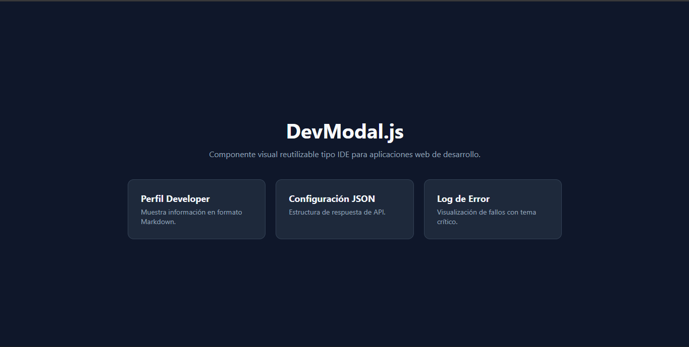
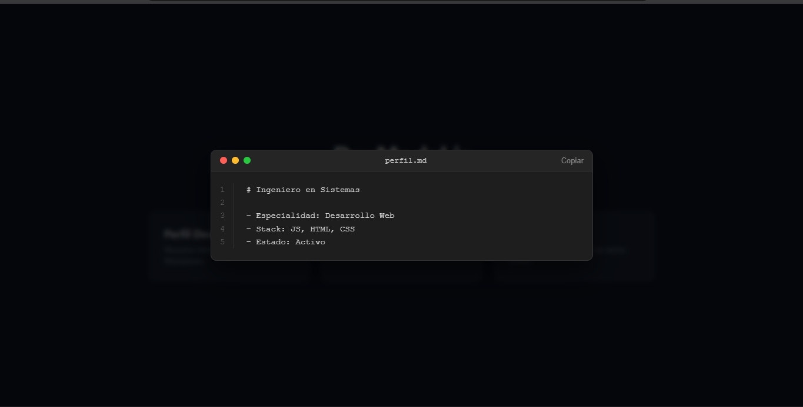

# DevModal.js 🖥️

**Componente Visual Interactivo de Ventana Modal tipo IDE**

---

## 📋 Descripción y Problema que Resuelve
En el desarrollo de software y portafolios web, las ventanas modales convencionales suelen ser planas y romper la estética de desarrollo. **DevModal.js** es una librería ligera escrita en Vanilla JavaScript y CSS3 que genera ventanas emergentes dinámicas estilizadas como un editor de código (macOS / IDE).

Calcula automáticamente el número de líneas del contenido, ofrece animaciones de apertura/cierre, permite copiar el contenido al portapapeles con un clic, responde a la tecla `Escape` y soporta temas dinámicos para errores o JSON.

---

## 🚀 Instalación
Para integrar **DevModal.js** en cualquier proyecto HTML, incluye los siguientes archivos:

```html
<!-- Hoja de estilos en el <head> -->
<link rel="stylesheet" href="css/devmodal.css">

<!-- Script antes del cierre de </body> -->
<script src="js/DevModal.js"></script>
<<<<<<< HEAD
=======

```


<<<<<<< HEAD
---
=======
---
>>>>>>> 8c7cecc (Corrigiendo cierre de codigo y rutas de imagenes)
>>>>>>> 5ae31f3cda25cb78ac0ccc5d08418ba74232e35f
